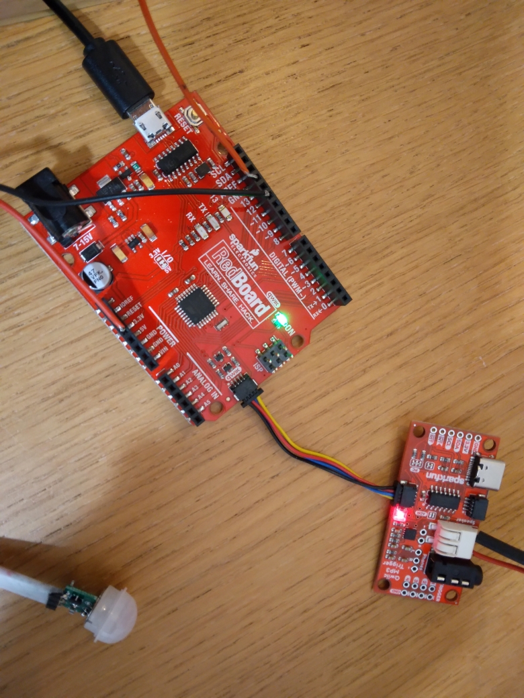
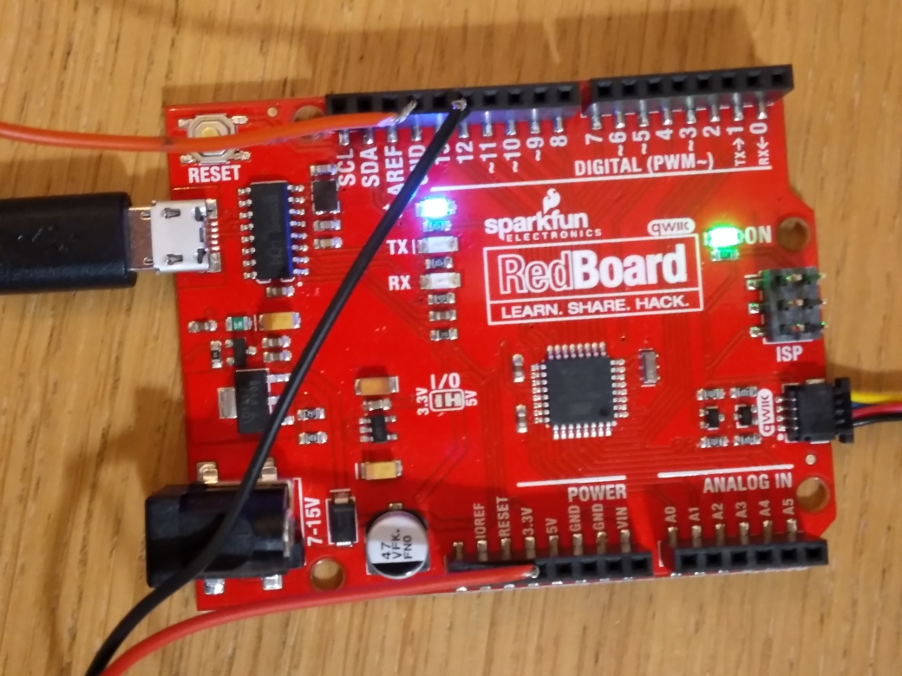
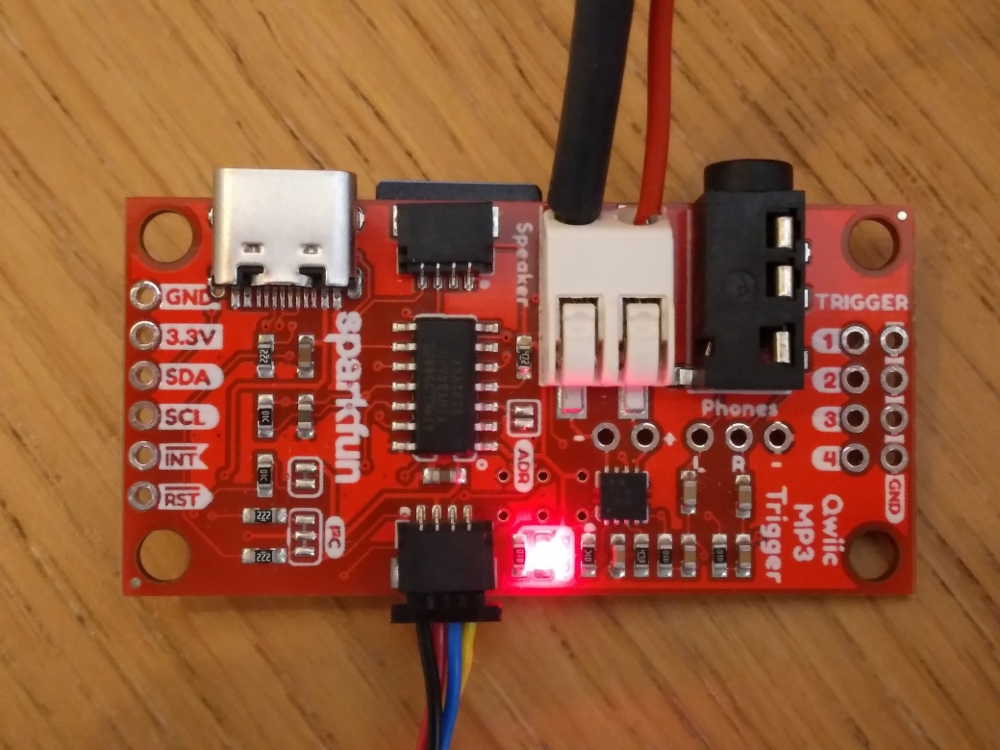
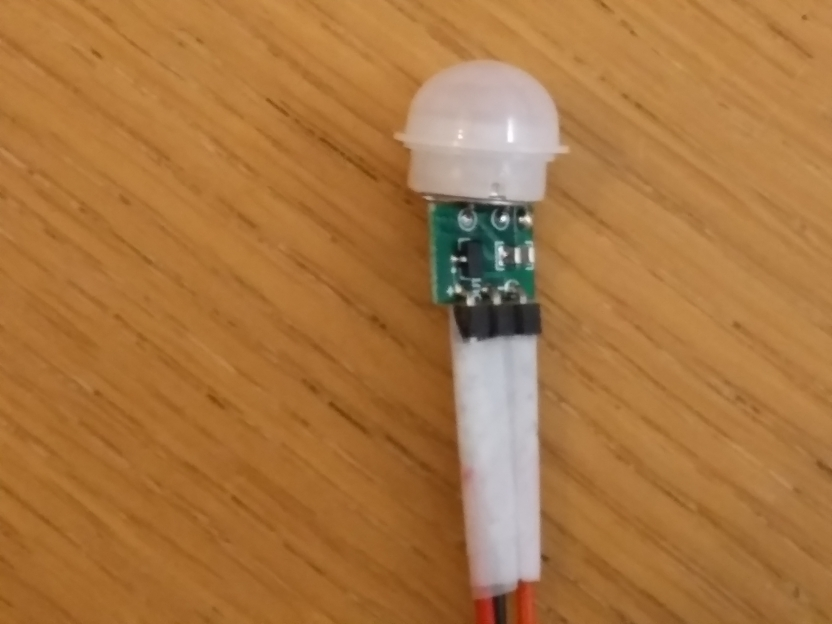
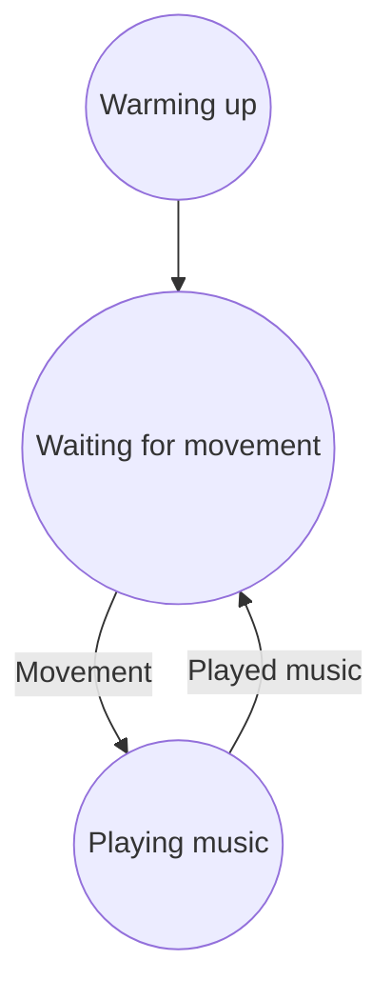

# musala

Code for Musala (not [the mountain peak](https://en.wikipedia.org/wiki/Musala)).

## Hardware



### SparkFun RedBoard



### SparkFun Qwiic MP3 Trigger



### PIR sensor



### Speaker

[no picture]

## Behavior



State               |LED                       |Music
--------------------|--------------------------|---------------------------------------
Warming up          |Blinking longer and longer|Playing longer and longer at low volume
Waiting for movement|Off                       |Off
Playing music       |Blinking longer and longer|Playing at full volume

## Booting times

See [booting_times.csv](booting_times.csv).

## Connections

From                  |To
----------------------|---------------------
Arduino 3.3 V         |PIR Vin
Arduino GND           |PIR GND
Arduino 12            |PIR out

### Troubleshooting

### Port not found

 * Ubuntu 22.04 Jammy Jellyfish LTS
 * Arduino IDE v2.0.1 [Linux 64 bit AppImage](https://github.com/arduino/arduino-ide/releases/download/2.0.1/arduino-ide_2.0.1_Linux_64bit.AppImage)

Earlier reported at [here](https://forum.arduino.cc/t/arduino-ide-2-0-not-showing-ports/858267/13)

Indeed:

```
sudo dmesg -w
```

Results in:


```
[ 3352.611354] usb 1-4: new full-speed USB device number 12 using xhci_hcd
[ 3352.761926] usb 1-4: New USB device found, idVendor=1a86, idProduct=7523, bcdDevice= 2.64
[ 3352.761939] usb 1-4: New USB device strings: Mfr=0, Product=2, SerialNumber=0
[ 3352.761944] usb 1-4: Product: USB Serial
[ 3352.764411] ch341 1-4:1.0: ch341-uart converter detected
[ 3352.765467] usb 1-4: ch341-uart converter now attached to ttyUSB0
[ 3353.314104] input: BRLTTY 6.4 Linux Screen Driver Keyboard as /devices/virtual/input/input32
[ 3353.436461] usb 1-4: usbfs: interface 0 claimed by ch341 while 'brltty' sets config #1
[ 3353.437038] ch341-uart ttyUSB0: ch341-uart converter now disconnected from ttyUSB0
[ 3353.437051] ch341 1-4:1.0: device disconnected
```

Solution: uninstall `brltty` by doing:

```
sudo apt-get remove brltty
```

## Links

 * [SparkFun board for Arduino IDE](https://github.com/sparkfun/Arduino_Boards.git)
 * Download boards from `https://github.com/sparkfun/Arduino_Boards/raw/main/IDE_Board_Manager/package_sparkfun_index.json`
 * [SparkFun Qwiic MP3 Trigger Arduino Library](https://github.com/sparkfun/SparkFun_Qwiic_MP3_Trigger_Arduino_Library)
